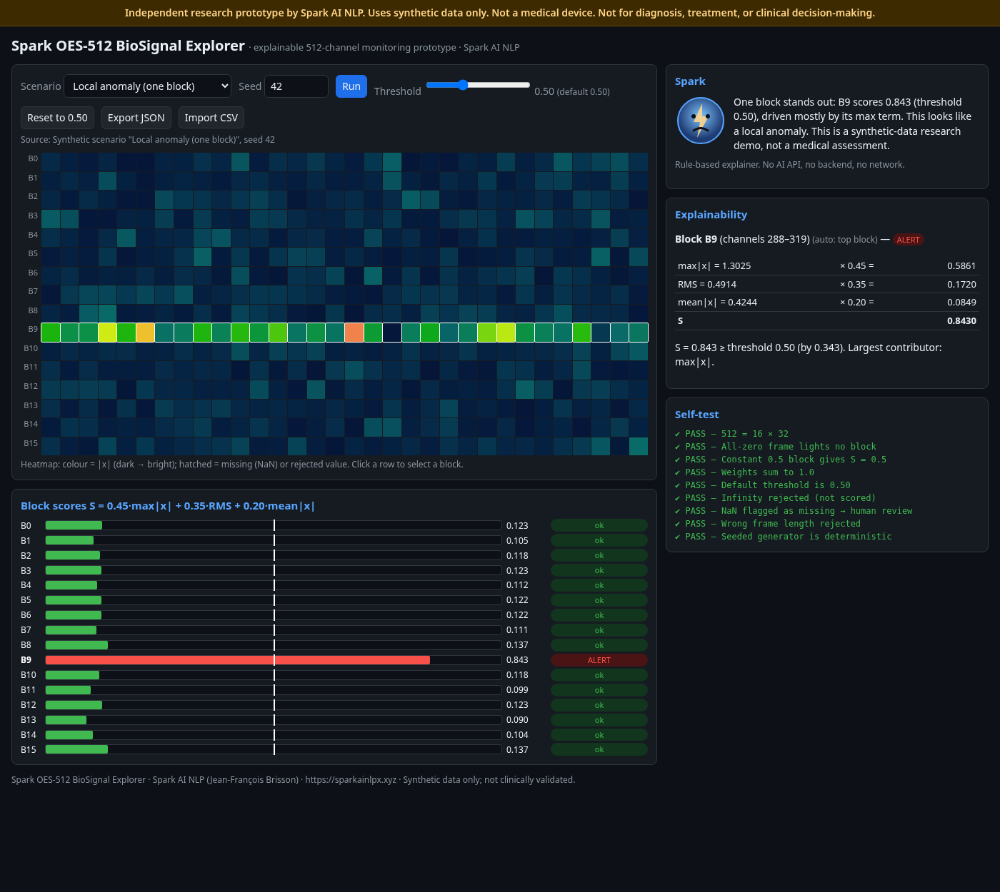
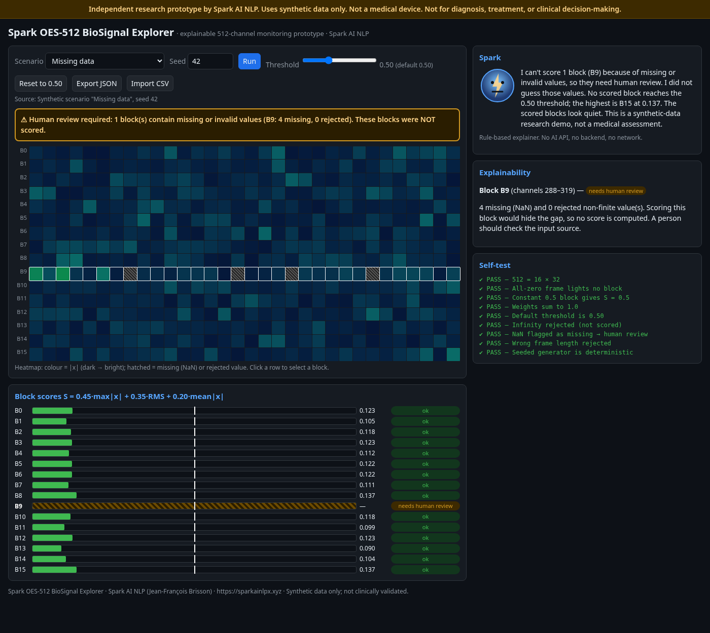

# Spark OES-512 BioSignal Explorer

An independent Spark AI NLP prototype for explainable 512-channel biosignal monitoring.

[](https://github.com/sparkainlp-x/spark-oes512-demo/actions/workflows/ci.yml)
[](LICENSE)
[](#safety-notice)
[](#safety-notice)

**Live demo:** https://sparkainlp-x.github.io/spark-oes512-demo/

> **Independent research prototype by Spark AI NLP. Uses synthetic data only. Not a medical device. Not for diagnosis, treatment, or clinical decision-making.**



## Overview

Spark OES-512 BioSignal Explorer is a single, self-contained HTML page that shows a 512-channel signal frame as 16 blocks of 32 channels, scores each block with a simple, transparent formula, and explains every result in plain language. It runs entirely in the browser: no backend, no AI API, no CDN, no external fonts and no network requests.

It is intended for interface and concept testing of explainable multi-channel monitoring, using synthetic data only.

Author: Jean-François Brisson, Spark AI NLP (https://sparkainlpx.xyz).

## Features

- 512-channel heatmap (16 blocks × 32 channels) with per-block score bars.
- Adjustable alert threshold slider (default 0.50) with a "Reset to 0.50" button.
- Seeded, deterministic synthetic scenarios: Normal, Local anomaly (one block), Drift (slow ramp), Global disturbance (all blocks), Missing data. Seed input and Run button.
- Explainability panel: the max, RMS and mean contributions of the selected (or top) block, and why it alerted or did not.
- Human-review warning state: missing data triggers human review and is never scored.
- JSON export of the scores and settings.
- Optional CSV import of 512 values (one row or one column); see `sample-512.csv`.
- A Spark avatar that explains each result in plain English (rule-based). No AI API, no backend.
- In-page self-test panel.



## Positioning

Spark OES-512 BioSignal Explorer is an independent Spark AI NLP project. It is not affiliated with, endorsed by, or associated with any external company, clinic, lab or medical organization.

## Safety Notice

- Not a medical device.
- Not diagnostic.
- Not for treatment or patient care.
- Not clinically validated.
- Uses synthetic data only.

## Technical Model

The block score is the same as in [oes-resilience](https://github.com/sparkainlp-x/oes-resilience) and [oes512q-latch](https://github.com/sparkainlp-x/oes512q-latch):

- a frame is **512 values = 16 blocks × 32 channels**;
- for each block: **`S = 0.45·max|x| + 0.35·RMS + 0.20·mean|x|`**;
- a block alerts when **`S ≥ threshold`**, default threshold **0.50** (adjustable in the page);
- **missing data (NaN) triggers human review and is never scored**: the block is flagged "needs human review" and no score is computed or guessed;
- ±Infinity or non-numeric values are rejected the same way (human review, not scored); a frame that is not exactly 512 values is refused.

The score logic lives in one place, the `<script id="core">` block of the page. `tests/run_tests.js` extracts that block and runs it in an isolated Node context, cross-checks every block against an independent reference formula, and verifies the scenarios, the human-review path, the CSV parser, the self-test and that the page is self-contained.

## Files

| Path | Contents |
|---|---|
| `spark-oes512-demo.html` | The self-contained app (main file) |
| `index.html` | Byte-identical copy of the main file, served by GitHub Pages (checked in CI) |
| `sample-512.csv` | Synthetic 512-value frame (one column) for the CSV import |
| `tests/run_tests.js` | Node tests on the core block extracted from the page |
| `tests/forbidden_terms.py` | Fails if a forbidden term appears in the repository |
| `docs/screenshot*.png` | Headless browser screenshots |
| `.github/workflows/ci.yml` | CI: Node 20 / 22 / 24 tests and forbidden-terms scan |
| `CITATION.cff`, `.zenodo.json` | Citation and archive metadata |
| `LICENSE`, `COMMERCIAL-LICENSE.md` | AGPL-3.0-only and commercial licensing |
| `CHANGELOG.md`, `SECURITY.md` | Changes and security policy |

## Run Locally

```bash
git clone https://github.com/sparkainlp-x/spark-oes512-demo.git
cd spark-oes512-demo
python -m http.server 8080
```

Then open http://localhost:8080/ (serves `index.html`). You can also open `spark-oes512-demo.html` directly in a browser; no server is required. URL parameters such as `?scenario=local&seed=42` preselect a scenario.

Tests:

```bash
node tests/run_tests.js           # Node >= 18
python3 tests/forbidden_terms.py  # repository-wide forbidden-terms scan
```

## Related

- [oes-resilience](https://github.com/sparkainlp-x/oes-resilience): the reference block score.
- [oes512q-latch](https://github.com/sparkainlp-x/oes512q-latch): the OES-32 / OES-512 classical residual latch using the same block score.

## Citation

If you use this software, please cite it using [CITATION.cff](CITATION.cff):

> Brisson, Jean-François. *Spark OES-512 BioSignal Explorer* (v0.1.0). Spark AI NLP. https://github.com/sparkainlp-x/spark-oes512-demo

A Zenodo DOI will be added after the first archived release.

## License

AGPL-3.0-only ([LICENSE](LICENSE)). For commercial licensing, see [COMMERCIAL-LICENSE.md](COMMERCIAL-LICENSE.md).

## Disclaimer

This software is an independent research prototype provided "as is", without warranty of any kind. It uses synthetic data only. It is not a medical device, is not clinically validated, and must not be used for diagnosis, treatment, patient care, or any clinical decision-making.
